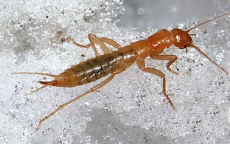
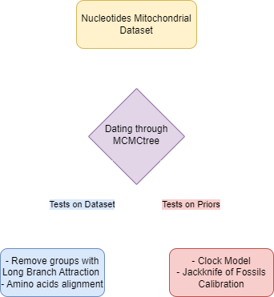
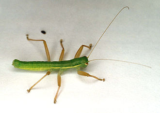

# Mitochondrial phylogenomics supports a Carboniferous origin of Xenonomia

This project aims to explore the robustness and sensitivity of molecular dating analyses within the Polyneoptera phylogeny using MCMCtree, with a focus on Xenonomia.\
RNA-Seq reads from two Grylloblattodea and two Mantophasmatodea species were used to assemble mitogenomes via a target-assembly approach, starting with two Xenonomia mitogenomes as references.\
Four distinct sensitivity tests were conducted to scrutinize key aspects influencing the dating results: two of them tested the dataset, while the others tested the priors.  

  
  
  

## 1. Testing the Dataset
### 1a. Long Branch Attraction possibly biases dating analyses

To investigate potential long-branch attraction bias, nucleotide alignments were analyzed twice: once including Embioptera and Zoraptera+Dermaptera, and once excluding them. The following species were systematically removed from the analyses:

- *Aposthonia borneensis*
- *Aposthonia japonica*
- *Eosembia sp.*
- *Zorotypus medoensis*
- *Challia fletcheri*
- *Euborellia arcanum*

### 1b. Amino Acids vs. Nucleotides Dating Analysis

To assess potential disparities in dating and confidence interval estimates, an analysis was conducted using amino acid alignments. This analysis utilized the complete set of fossils for calibration.

## 2. Testing the Priors

### 2a. Fossil Prior Influence - Fossils Jackknife

To assess the impact of individual fossils on dating analyses, a fossils jackknife approach was employed. Each of the five fossils was systematically removed, and five runs were conducted for each scenario. This analysis was performed under all three clock models implemented in MCMCtree.

### 2b. Clock Model Sensitivity Analysis

Exploring the influence of different clock models, analyses were conducted using all three clock models implemented in MCMCtree. This investigation aims to determine whether the choice of clock model affects the dating results.

These sensitivity tests provide a comprehensive understanding of the factors influencing the dating analyses, including the impact of specific taxa, fossils, clock models, and the choice of molecular data type (nucleotides vs. amino acids). The results contribute valuable insights into the robustness and reliability of dating estimates within the context of Polyneoptera phylogeny.

## Folder structure and results storage
All scripts and commands can be found [here](Scripts) as follows:  
1. Mitochondrial assembly and annotation (TO BE ADDED BY GIOBBE).
2. [Data preparation](Scripts/Data_preparation.md).
3. [Phylogenetic inference](Scripts/Phylogenetic_inference).
4. [MCMCtree dating analysis](Scripts/MCMCtree.md).
5. [R plots](Scripts/Plots.R).

Mitogenome assemblies of the four "new" species in .genbank format are available in [Assembly](Assembly).

The results for the runs with all the fossils are stored in [All_Fossils_NTs](All_Fossils_NTs), there you can find:
- the [lnL stats](All_Fossils/lnL) for convergence of 5 runs for each model with and without Embioptera and Zoraptera+Dermaptera (20x10^6 gen with 10% burnin);
- the trees in .pdf for each model with and without Embioptera and Zoraptera+Dermaptera are in [this](All_Fossils_NTs/Trees.pdf) directory;
- radarcharts for each clock model comparing the dating with and without Embioptera and Zoraptera+Dermaptera are in [this](All_Fossils_NTs/Radarcharts.pdf) directory.

The same folder structure has been kept for the Jackknife analysis: [No_1](No_1),[No_2](No_2),[No_3](No_3),[No_4](No_4),[No_5](No_5).  
The radarchart plot with the jackknife can be found [here](Radarcharts_Jackknife/).  
All scripts can be found [here](Bash_Scripts).  
The results of the runs with the AAs alignment can be found in [All_Fossils_AAs](All_fossils_AAs), with the same subdirectories structure as the nt directory and with [radarcharts](All_fossils_AAs/Radarcharts.pdf/) comparing nt and AA results for the groups of interest.  
All ML trees can be found [here](All_Trees_Supp/All_ML_Trees_Supp.pdf), and dated trees can be found [here](All_Trees_Supp/All_Dated_Trees_Supp.pdf).
## Paper draft
[Link](https://docs.google.com/document/d/1J3gq3wQtmarodkV0guRLSztjU48_idVBuGVGOqmFKoQ/edit?hl=it&pli=1#heading=h.kyh1jjl3h2e2) to the draft.  
